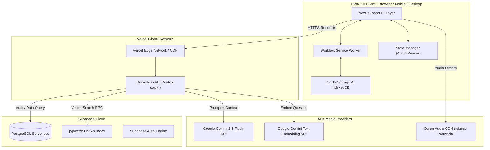
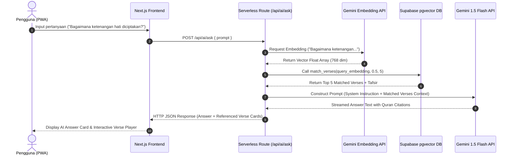
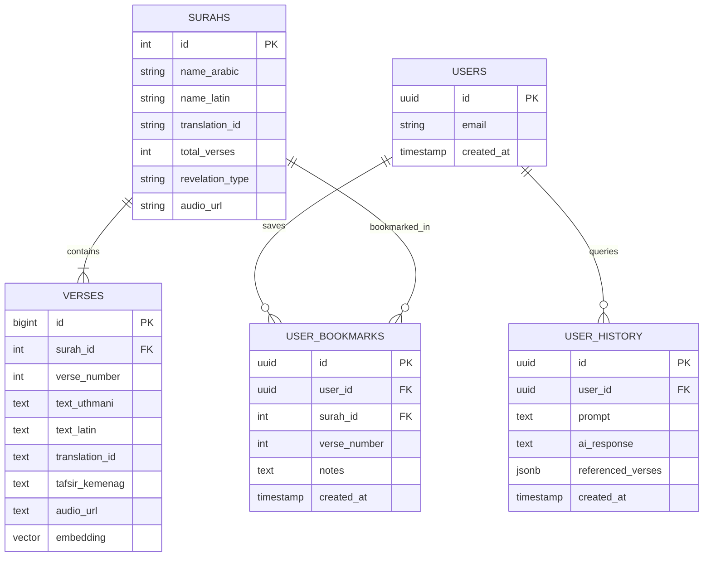

# 🏗️ System Design Document - IQRO

**Project Name:** IQRO  
**Domain:** `iqro.artbycode.id`  
**Deployment Infrastructure:** Vercel Global Edge Network + Supabase PostgreSQL  

---

## 1. High-Level System Architecture

---

## 2. End-to-End RAG Sequence Diagram

---

## 3. Database Entity Relationship Diagram (ERD)

