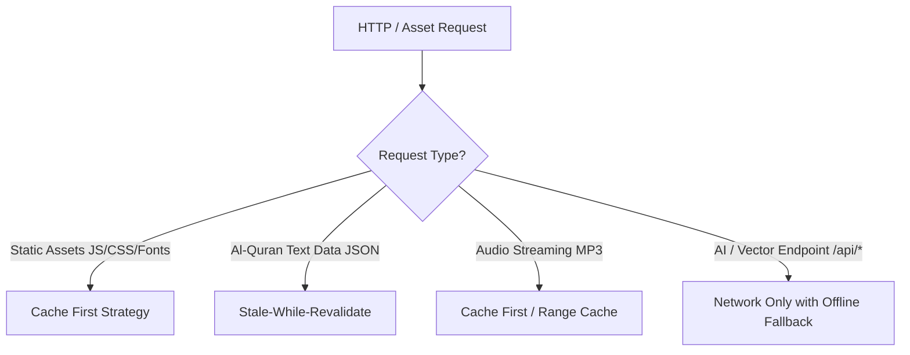

# 🛠️ Technical Design Document (TDD) - IQRO

**Project Name:** IQRO  
**Target Domain:** `iqro.artbycode.id`  
**Architecture Pattern:** Serverless Web Application + Progressive Web App (PWA 2.0) + Vector RAG Pipeline  
**Stack Status:** Latest Production Stable Releases (2026)  

---

## 1. Technical Stack & Versions

| Layer | Technology | Version | Purpose & Description |
| :--- | :--- | :--- | :--- |
| **Framework** | **Next.js** | `^15.1.0` (App Router) | React 19 framework dengan Server Components, Edge/Serverless API Routes, dan Fast Refresh. |
| **UI Library** | **React** | `^19.0.0` | Core UI Engine dengan Concurrent Rendering & Suspense. |
| **Styling** | **Tailwind CSS** | `^4.0.0` | Utility-first CSS framework dengan engine terbaru berbasis LightningCSS. |
| **Icons & Motion**| **Lucide React & Framer Motion**| `lucide-react@^0.470`, `framer-motion@^12.0` | Ikonografi modern dan animasi micro-interaction yang halus. |
| **Database** | **Supabase Postgres** | `@supabase/supabase-js@^2.48`, `pgvector` | PostgreSQL Serverless dengan ekstensi vector search untuk RAG Al-Qur'an. |
| **AI SDK** | **Google GenAI SDK** | `@google/genai@^0.1.1` | Official Google SDK untuk Gemini 1.5 Flash & Text Embedding (`text-embedding-004`). |
| **PWA Engine** | **Next-PWA** | `@ducanh2912/next-pwa@^10.2` | Workbox 7 wrapper untuk auto Service Worker generation, caching strategy, & offline fallback. |
| **State Management**| **Zustand** | `^5.0.0` | Global state ringan untuk Audio Player, User Settings, dan Bookmark cache. |
| **Audio Engine** | **Web Audio API / Howler** | Native HTML5 Audio | Handler streaming audio tilawah Al-Qur'an per-ayat dan per-surah. |

---

## 2. Directory & Component Architecture

```
iqro-artbc/
├── public/
│   ├── manifest.json              # PWA 2.0 Web App Manifest
│   ├── sw.js                      # Custom Service Worker (jika dikustomisasi)
│   ├── icons/                     # Icons multi-resolution (192x192, 512x512, maskable)
│   └── fonts/                     # Font Arab Uthmani (Scheherazade / Amiri)
├── src/
│   ├── app/                       # Next.js App Router Structure
│   │   ├── layout.tsx             # Root Layout (Fonts, PWA Provider, Theme)
│   │   ├── page.tsx               # Homepage / AI Assistant Interface
│   │   ├── quran/                 # Al-Qur'an Reader Routes
│   │   │   ├── page.tsx           # Index 114 Surah
│   │   │   └── [surahId]/         # Surah Detail & Verses View
│   │   ├── history/               # User Query & Bookmark History
│   │   └── api/
│   │       ├── ai/
│   │       │   └── ask/route.ts   # Serverless Edge Route: RAG + Gemini Inference
│   │       └── quran/
│   │           └── search/route.ts# Fast Vector Search API
│   ├── components/                # Modular Component System
│   │   ├── ui/                    # Reusable Atomic UI (Button, Input, Card, Modal)
│   │   ├── pwa/                   # PWA Install Prompt, Offline Banner, SW Register
│   │   ├── ai/                    # AI Chat Box, Prompt Suggestions, RAG Response Card
│   │   ├── quran/                 # Surah Card, Verse Item, Audio Player Bar, Tafsir Modal
│   │   └── layout/                # Navbar, Sidebar, Footer, Mobile Navigation Bar
│   ├── lib/                       # Core Clients & Utilities
│   │   ├── supabase/
│   │   │   ├── client.ts          # Browser Supabase Client
│   │   │   └── server.ts          # Server Supabase Client (RLS Support)
│   │   ├── gemini/
│   │   │   ├── client.ts          # Gemini SDK Initialization
│   │   │   ├── embedding.ts       # Text Embedding Vector Generator
│   │   │   └── prompts.ts         # System Prompts & Guardrails for Gemini
│   │   └── utils/                 # Formatters, Arabic Numeral Converters, Local Storage
│   ├── store/                     # Zustand Stores
│   │   ├── useAudioStore.ts       # Audio Player State (Current Surah, Verse, Playing/Pause)
│   │   ├── useQuranStore.ts       # Reader Settings (Font Size, Translation Toggle)
│   │   └── useBookmarkStore.ts    # Favorites & Reading History
│   └── types/                     # TypeScript Interfaces & Database Schemas
│       ├── quran.ts
│       ├── ai.ts
│       └── database.ts
├── next.config.mjs                # Next.js Config + PWA Plugin Configuration
├── tailwind.config.ts             # Custom Design Tokens & Themes
└── package.json
```

---

## 3. Core System Data Flow & Architecture

### 3.1 RAG (Retrieval-Augmented Generation) Pipeline Flow

```
[ User Input Question ] ──( 1. Post to /api/ai/ask )──> [ Next.js API Route ]
                                                               │
                                                       ( 2. Generate Vector )
                                                               │
                                                               ▼
                                                     [ Gemini Embedding Model ]
                                                     ( text-embedding-004 )
                                                               │
                                                       ( 3. Vector 768-dim )
                                                               │
                                                               ▼
                                                     [ Supabase PostgreSQL ]
                                                     ( pgvector match_verses )
                                                               │
                                                    ( 4. Return Top 5 Relevant )
                                                    (    Ayahs + Tafsir Context)
                                                               │
                                                               ▼
                                                     [ Gemini 1.5 Flash API ]
                                                     ( System Prompt + Context )
                                                               │
                                                       ( 5. Structured Stream )
                                                               │
                                                               ▼
                                                     [ User UI Render Card ]
```

---

## 4. PWA 2.0 Caching & Service Worker Strategy

IQRO menggunakan strategi caching bertingkat dari Workbox melalui `@ducanh2912/next-pwa`:



1. **Cache-First for Static Shell**: App Shell, font Uthmani, CSS, dan JS dikonsumsi langsung dari `CacheStorage` untuk instant load (< 0.5s).
2. **Stale-While-Revalidate for Quran Content**: Teks ayat dan terjemahan disajikan dari cache lokal secara instan sambil memperbarui cache di latar belakang jika ada update data.
3. **Network-Only with Custom Offline Page for AI**: Karena fitur AI membutuhkan koneksi internet, jika koneksi luring, UI menampilkan *Offline AI Guard Banner* dan mengarahkan pengguna ke mode baca Al-Qur'an offline.

---

## 5. Security & Environment Configuration

### Required Environment Variables (`.env.local` & Vercel Dashboard):

```env
# Google Gemini AI API Key
GEMINI_API_KEY="AIzaSy..."

# Supabase Credentials
NEXT_PUBLIC_SUPABASE_URL="https://xxx.supabase.co"
NEXT_PUBLIC_SUPABASE_ANON_KEY="eyJhbGci..."
SUPABASE_SERVICE_ROLE_KEY="eyJhbGci..." # Server-only for data seeding/indexing

# Public Domain & App Meta
NEXT_PUBLIC_APP_URL="https://iqro.artbycode.id"
```
